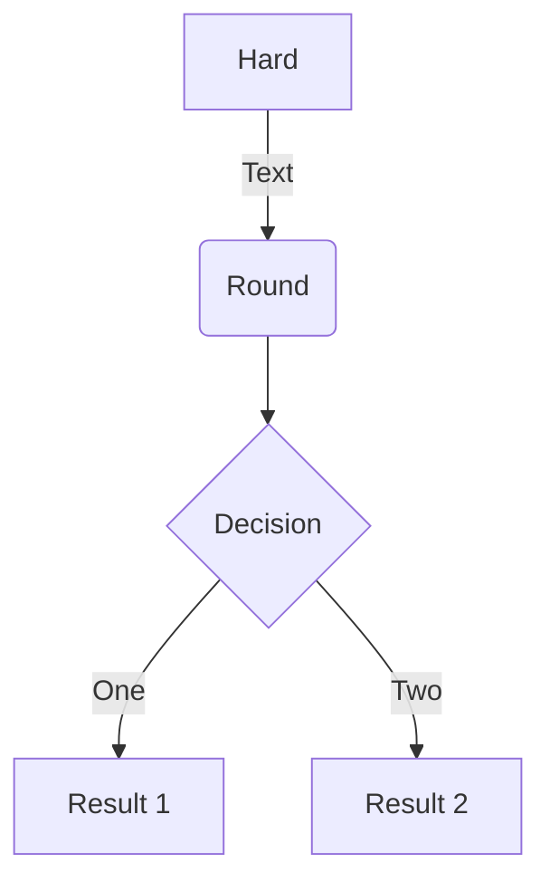

移轴镜头作为一种特殊的拍摄手法，经常出现在电影中

<!--more-->


移轴摄影会拍出小人国的效果的原因：在正常情况下，景深同对焦点距离成正比，同镜头焦距长度成反比，人眼也符合这个规律，大脑在长期的训练下也默认了这个规则。移轴镜头可以改变光路，使得焦平面和感光平面不平行，只有两个平面相交的那条线附近的景物清晰，造成特殊的“浅景深”。那种看起来像模型的移轴照片多是广角远距离拍摄，在大脑的规则中，这种距离的广角视角下不可能出现浅景深，所以会产生错觉，以为这是近距离摄影。在近距离景物又比较小的话，就像是模型了。


**视频转载于无限飓风**

### Code

Wowchemy supports a Markdown extension for highlighting code syntax. You can enable this feature by toggling the `syntax_highlighter` option in your `config/_default/params.toml` file.

    ```python
    import pandas as pd
    data = pd.read_csv("data.csv")
    data.head()
    ```

renders as

```python
import pandas as pd
data = pd.read_csv("data.csv")
data.head()
```

### Charts

Save your Plotly JSON in your page folder, for example `line-chart.json`, and then add the `` shortcode where you would like the chart to appear.

Demo:



### Diagrams

An example **flowchart**:

    ```mermaid
    graph TD
    A[Hard] -->|Text| B(Round)
    B --> C{Decision}
    C -->|One| D[Result 1]
    C -->|Two| E[Result 2]
    ```

renders as




### Tables

Save your spreadsheet as a CSV file in your page's folder and then render it by adding the _Table_ shortcode to your page:

```go

```

renders as


